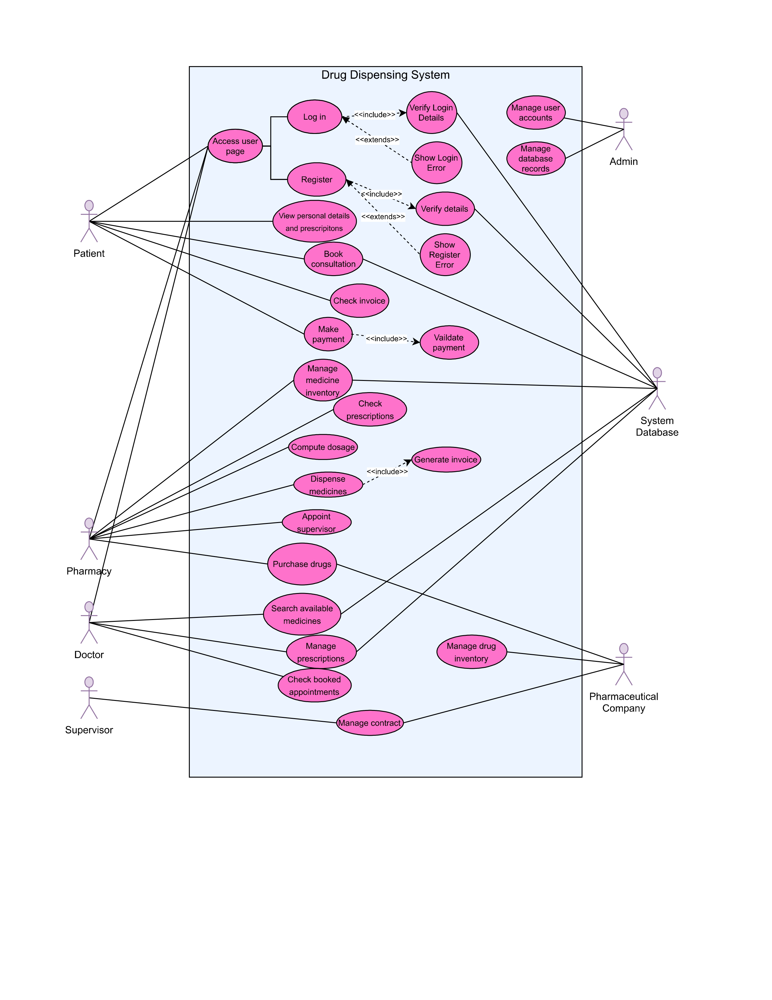

# Project: Drug Dispensing tool
## Purpose of the project
This project focuses on developing a web-based drug dispensing tool that allows the management of drugs, as well as the dispensing of drugs to patients.

---

### Additional Requirements:
#### Functional Requirements
The system should:
1. Allow the management of pharmaceutical companies, pharmacies, doctors, and patients via various database operations.
2. Allow pharmaceutical companies, patients, doctors, and pharmacies to register into the system.
3. Allow patients to login and view their details, or select medicines that they require.
4. Print an invoice or receipt containing details of medicines selected by the patient.

#### Non-functional Requirements
The system should:
1. Have an interactive GUI.
2. Have a sign-in interface for both administrative access and user access.
3. Be accessible to the public, both members and non-members, as well as on desktop and mobile platforms.
4. Have fast access to all users.
5. Return to the main page in the event that an action on other pages fails.

## System Design
### Entity Relationship Diagram

---
### Use Case Diagram

---

## Project Collaborators:
[151168 - Isaboke, Fidel Agade](https://github.com/Fidelisaboke)  
[150909 - Kithinji, George Fundi](https://github.com/Gendi-kinji)
